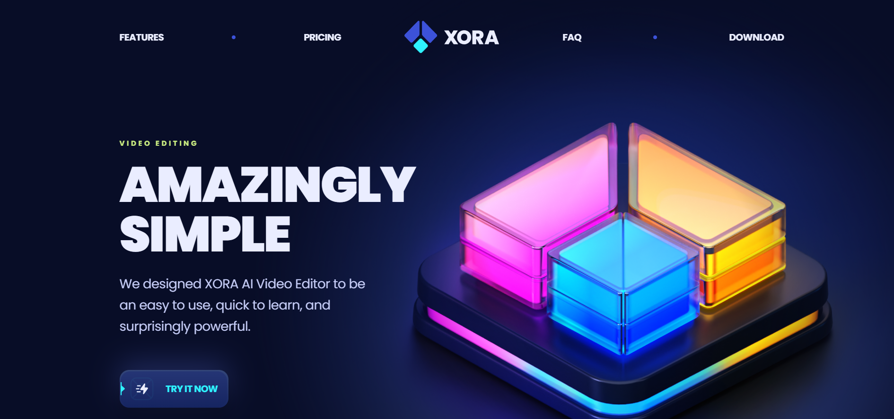

<div align="center">
  <br />
  
  <br />

  <div>
    
    
    
    
    
    
  </div>

  <h3 align="center">SaaS UI - Modern Landing Page</h3>

  <div align="center">
    A fast and elegant SaaS landing page built with React, Vite, and Tailwind CSS. Features smooth scroll, counters, dropdowns, and responsive UI elements optimized for performance and clarity.
  </div>

  <div align="center">
    🌐 <strong>Live Demo</strong>: <a href="https://your-live-demo-link.com">View Site</a>
  </div>
</div>

---

## 📋 Table of Contents

1. [Introduction](#introduction)  
2. [Tech Stack](#tech-stack)  
3. [Features](#features)  
4. [Quick Start](#quick-start)  
5. [Installation](#installation)  
6. [Scripts](#scripts)  
7. [License](#license)  
8. [Acknowledgements](#acknowledgements)  

---

## 🧾 Introduction

**SaaS UI** is a sleek, responsive landing page template perfect for SaaS startups and product showcases. Developed using modern frontend tools and libraries, it demonstrates best practices in component structure, style separation, animation, and layout responsiveness.

---

## 🧰 Tech Stack

- **Vite** – Next-gen frontend tooling  
- **React.js** – Component-based UI development  
- **Tailwind CSS** – Utility-first CSS framework  
- **React Scroll** – Smooth anchor scrolling  
- **React SlideDown** – Expand/collapse transitions  
- **React CountUp** – Animated number counters  
- **ESLint** – Linting and code quality checks

---

## ✨ Features

✅ Clean and modern layout  
✅ Lightning-fast development with Vite  
✅ Utility-first responsive styling with Tailwind CSS  
✅ Animated dropdown sections  
✅ Scroll-based smooth navigation  
✅ Count-up effects for metrics/stats  
✅ Component-driven React structure  
✅ Easily extendable and customizable

---

## ⚡ Quick Start

### Prerequisites

Make sure the following are installed:

- [Git](https://git-scm.com/)
- [Node.js](https://nodejs.org/)
- [npm](https://www.npmjs.com/)

### Clone the Repository

```bash
git clone https://github.com/your-username/saas-ui.git
cd saas-ui
```
### 📦 Installation
Step 1: Install the project dependencies
```bash
npm install
```
Step 2: Start the development server
```bash
npm run dev
```
The app will be available at: http://localhost:5173/ by default.

### 🛠️ Scripts
Command	Description
- npm run dev	Starts the Vite development server
- npm run build	Builds the app for production
- npm run preview	Previews the production build
- npm run lint	Runs ESLint to lint the code

 ### 📄 License
This project is licensed under the MIT License. See the LICENSE file for more details.

### 🙌 Acknowledgements
This project uses open-source libraries and tools:

- React.js

- Vite

- Tailwind CSS

- React Scroll

- React SlideDown

- React CountUp

- ESLint

### 🙋‍♂️ Author
Karthick Ram Alagar
 - 💻 Frontend Developer | Passionate about clean UI and performance
- 🔗  GitHub : (https://github.com/KarthickRamAlagar)
- 🌐 Linkedin :(https://www.linkedin.com/in/karthickeyan-ramalagar-763404370/)


